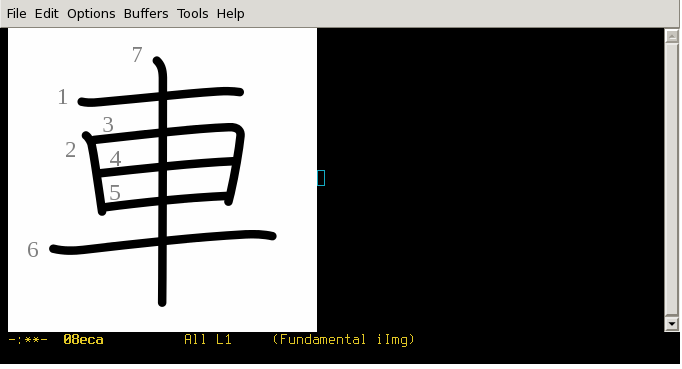

kanji-mode
==========

About
-----
This is a minor mode for GNU Emacs aiming to address a common need of Japanese language learners - getting the stroke order of a particular Kanji sign. It has a built-in collection of SVG images depicting stroke orders for all Kanji. The collection is a slightly modified and limited version of the SVGs provided by the [KanjiVG](http://kanjivg.tagaini.net/) project. The mode's operation is pretty simple. It retrieves the Unicode code of the character under the Emacs cursor and uses it to retrieve the proper SVG file (the files are happily named using Unicode numbers). It then displays the relevant SVG in a transient buffer.

Installation
------------
To install `kanji-mode` download this repository somewhere you keep your Emacs modes (I keep it under `~/.emacs.d/`). Then follow these simple steps:
* Make sure the `kanji-mode` directory is part of your Emacs `load-path`. You can do it by adding the following line to your `.emacs` configuration file: `(add-to-list 'load-path "/path/to/your/kanji-mode")`
* Require `kanji-mode` by adding the following to `.emacs`: `(require 'kanji-mode)`. `kanji-mode` adds a hook to `text-mode`, so it should launch automatically whenever you edit a text file. If you need it in other circumstances (temporary buffers, etc.), you can always launch it manually by hitting <kbd>M-x</kbd> and entering "kanji-mode".

Usage
-----
Once `kanji-mode` is active, you should be able to see the string "kanji" in the minor mode list in the buffer mode line at the bottom. Whenever you want to check the stroke order for a character under the cursor, hit <kbd>M-s M-o</kbd> (I tried to make this keybinding intuitively suggest "**s**troke **o**rder") and a new buffer will appear, containing the image of your character with its stroke order. When you're done viewing it, hit <kbd>q</kbd> to close the buffer and return to your text. Below are two screenshots showing an example usage:

Acknowledgements
----------------
I'd like to thank Ulrich Apel and all contributors of the [KanjiVG](http://kanjivg.tagaini.net/) project for doing the meticulous work I'd never have the patience to do. I've only made small changes to their files (added a white background so it works well with dark Emacs themes and incresed the size to make it more legible) and dropped variants (Kaisho, etc.) since they were unusable in my mode.
